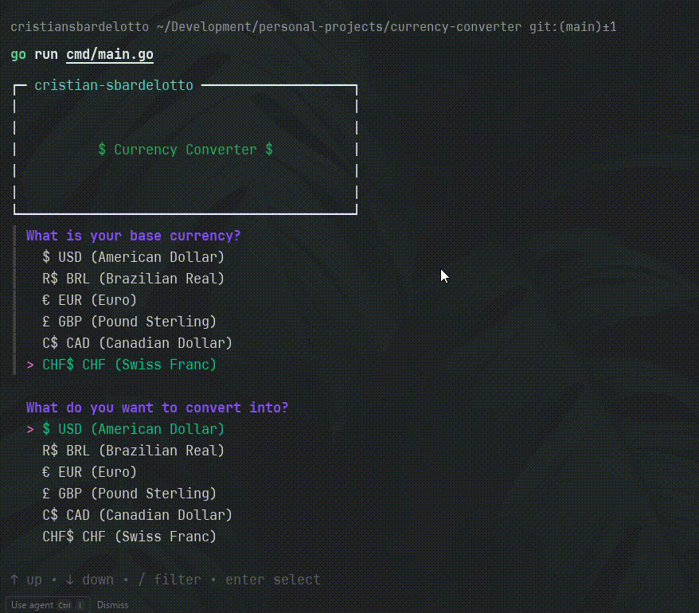

# currency-converter-tui

A terminal user interface (TUI) application for converting currencies using real-time exchange rates.



**Supported currencies:**

- USD (United States Dollar)
- BRL (Brazilian Real)
- EUR (Euro)
- GBP (Pound Sterling)
- CAD (Canadian Dollar)
- CHF (Swiss Franc)

> ⚠️ Feel free to [contact me](https://cristiansbardelotto.com.br/contact), and share your **_feedback_** and **_insights_**, or report a **_bug_**!

<p>
  <a href="#features">Technologies</a>&nbsp;&nbsp;&nbsp;|&nbsp;&nbsp;&nbsp;
  <a href="#reproduce">Steps to reproduce</a>&nbsp;&nbsp;&nbsp;&nbsp;&nbsp;&nbsp;
</p>

<div id='technologies'></div>

## 🛠️ Technologies

This project was built with the following technologies:

- Go (Golang)
- Pterm (Terminal Logs and UI)
- Huh (User Interaction and Input Handling)
- Git & Github

<div id='reproduce'></div>

## 🚀 Steps to Reproduce

1. Clone the repository:

   ```bash
   git clone
   ```

2. Navigate to the project directory:
   ```bash
   cd currency-converter-tui
   ```
3. Signup to [openexchangerates.org](https://openexchangerates.org/) API and get your free API key.
4. Set your API key as an environment variable, as the [example file](./.env.example).
5. Run the application:
   ```bash
   go run cmd/main.go
   ```

## Enjoy this project!

Developed with 🧡 by **Cristian Sbardelotto**.

[](https://www.linkedin.com/in/cristian-k-sbardelotto/)
[](https://github.com/cristian-sbardelotto)
[](https://cristiansbardelotto.com.br)
